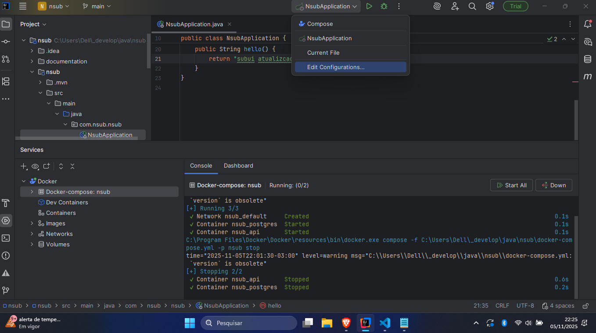
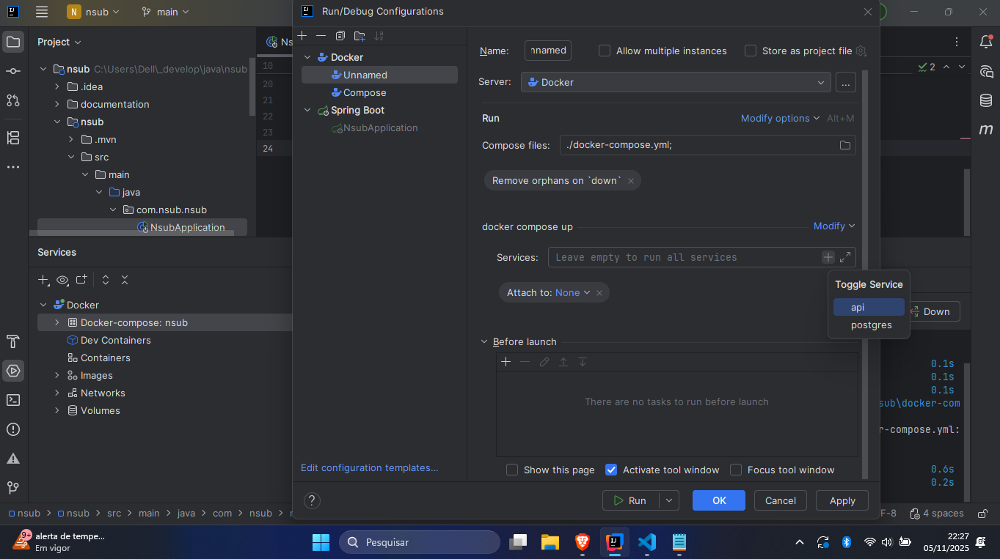

#  how to configure docker compose with live reload - [reference commit](https://github.com/DeykyPinheiro/nsub/commit/2e9cfbe4fba85ab318fe3ca60eeb68a249c6c2b7)


it works on intelij and out

add in dependencies  on pom.xml
```
<dependency>
    <groupId>org.springframework.boot</groupId>
    <artifactId>spring-boot-devtools</artifactId>
    <scope>runtime</scope>
    <optional>true</optional>
</dependency>
```

configure docker-compose.yml
```
version: "3.9"

services:
  postgres:
    image: postgres:16
    container_name: nsub_postgres
    environment:
      POSTGRES_DB: nsub
      POSTGRES_USER: nsub
      POSTGRES_PASSWORD: nsub
    ports:
      - "5432:5432"
    volumes:
      - postgres_data:/var/lib/postgresql/data

  api:
    build:
      context: .
      dockerfile: Dockerfile.dev
    container_name: nsub_api
    ports:
      - "8080:8080"
      - "5005:5005" # debug port
    environment:
      SPRING_DATASOURCE_URL: jdbc:postgresql://postgres:5432/nsub
      SPRING_DATASOURCE_USERNAME: nsub
      SPRING_DATASOURCE_PASSWORD: nsub
    volumes:
      - ./nsub:/app # heart live reload, when saved file, change in container
      - mvn_cache:/root/.m2
    command: ["./mvnw", "spring-boot:run", "-Dspring-boot.run.jvmArguments=-agentlib:jdwp=transport=dt_socket,server=y,suspend=n,address=*:5005"]
    depends_on:
      - postgres
    extra_hosts:
      - "host.docker.internal:host-gateway" # access services host

volumes:
  postgres_data:
  mvn_cache:
```


configure dockerfile.dev
```
FROM eclipse-temurin:17-jdk as dev

WORKDIR /app

# Copia wrapper e config
COPY nsub/mvnw .
COPY nsub/.mvn .mvn
COPY nsub/pom.xml .

# Baixa dependências (cache)
RUN ./mvnw dependency:go-offline -B

# Copia código (vai ser sobrescrito pelo volume em dev)
COPY nsub/src ./src

EXPOSE 8080
EXPOSE 5005

CMD ["./mvnw", "spring-boot:run"]
```

application.yml
```
spring:
  application:
    name: nsub

  devtools:
    restart:
      enabled: true
      poll-interval: 1000 # verify chances each 1secund
      quiet-period: 400 # wait 400ms before restart
    livereload:
      enabled: true

  datasource:
    url: ${SPRING_DATASOURCE_URL}
    username: ${SPRING_DATASOURCE_USERNAME}
    password: ${SPRING_DATASOURCE_PASSWORD}
```


how to configure run configurations on intelij

Edit profile Intelij



Create dockercompose


Add services



Change execution


it also works outside of
```
docker compose down -v
docker compose up --build
```