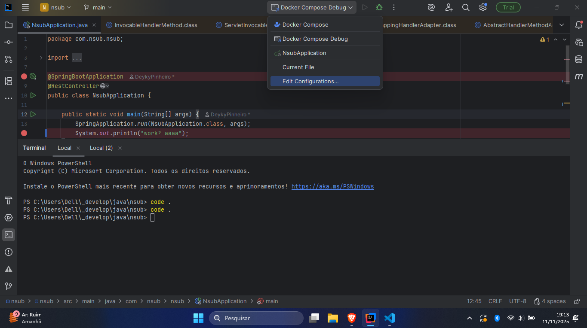
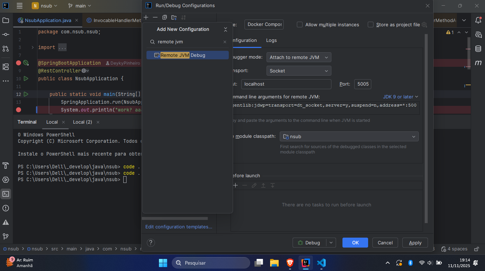
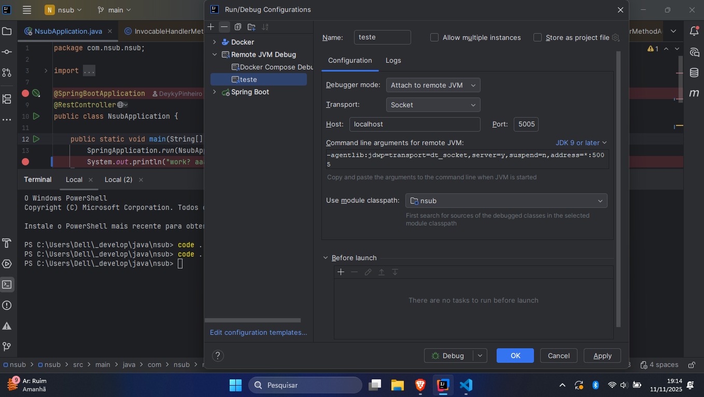
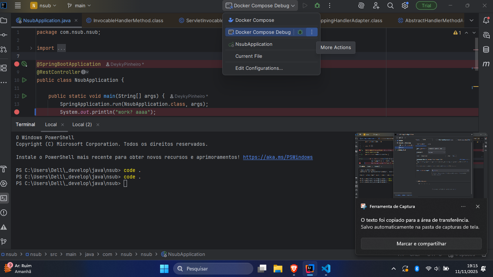

#  run and debug with container on intelij - [reference commit](https://github.com/DeykyPinheiro/nsub/commit/6fead8aa259b2f4f66b1dda93fdc09f907a81f3c)

select edit configurations

search for "remote jvm debug"

atach on select port

select profile created

